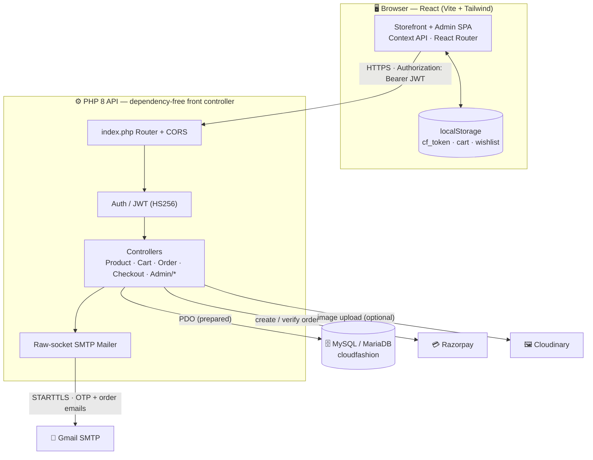
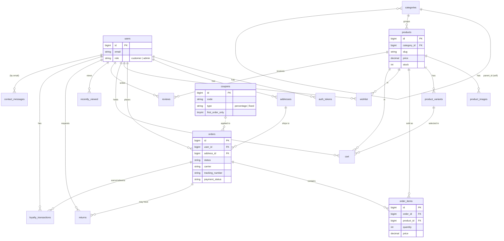
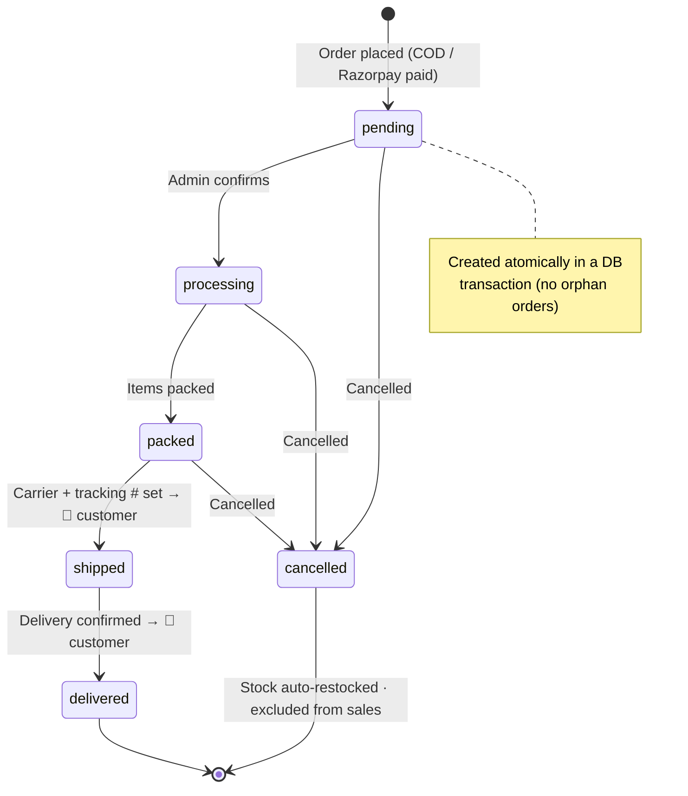
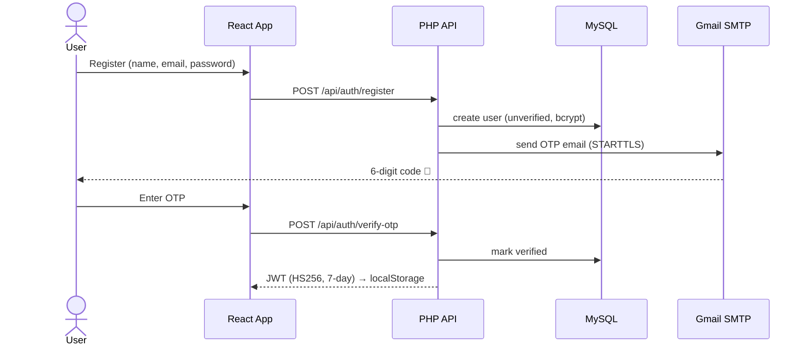
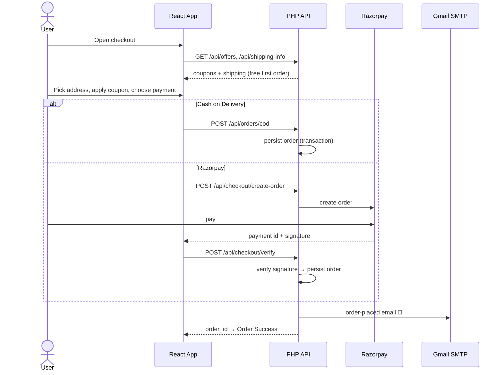

# ☁️ Cloud Fashion

A complete, production-ready **single-vendor fashion e-commerce** web application with a premium, luxury UI — featuring a glassmorphism design, dark/light mode, full customer storefront, and a powerful admin dashboard.

**Stack:** React (Vite) + Tailwind CSS · PHP 8 (dependency-free) · MySQL/MariaDB · JWT + Email OTP + **Google Sign-In** · Cloudinary · Razorpay

---

## 🏗️ System Architecture



---

## ✨ Features

### Customer
- **Auth** — Register, Login, Logout, **real Email OTP verification** (live Gmail SMTP), **Google Sign-In** (OAuth — find-or-create user), Forgot/Reset password (JWT-based, **7-day sliding sessions** that refresh on activity and stay logged in until manual logout)
- **Home** — Hero slider, featured categories (**live category images**), new arrivals, trending, best sellers, **admin-managed promo banners**, live **offers strip**, **"Shop the Sale"** → on-sale filter
- **Catalog** — Search, **dynamic facet filters** built from live DB data (category, brand, size, **color swatches**, price range), sort (price/popularity/newest/rating/**discount**), **on-sale** filter, pagination
- **Product page** — Image gallery with **zoom**, **Quick View** side drawer, specs, variants (size/color), **size-guide modal**, stock, **reviews & ratings with rating breakdown**, **frequently-bought-together**, related products, **share buttons**, **"notify me when back in stock"**
- **Reviews 2.0** — Verified buyers can review **after delivery**; star rating + title + comment, per-product rating breakdown bars
- **Product comparison** — Add items to a **compare bar** and view side-by-side specs
- **Wishlist**, **Cart** (variant-aware, live totals)
- **Loyalty & Referrals** — Earn points on every order (configurable rate + **per-order cap**), **redeem at checkout** (configurable ₹ value per point) optionally, unique **referral code** (friend gets a signup bonus, you get a one-time referral bonus on their first order); Rewards tab with balance + history
- **Checkout** — Address management, **live available-coupons chips** (tap to apply), **loyalty points redemption**, **Razorpay** online payment + **COD**
  - **Smart shipping** — first order ships **free**; repeat orders free above the (admin-set) threshold, else a flat fee
  - **First-order-only coupons** (e.g. `WELCOME10`) validated against order history
  - Atomic order creation (DB transaction — no orphan orders on failure)
- **Orders** — History, detail with status timeline, **shipment tracking** (carrier + tracking #), **Reorder**, cancel & auto-restock, **post-delivery reviews**, **Returns/Refund requests (RMA)**
- **Order emails** — Order-placed confirmation + status-update + **return-status** emails
- **Profile** — Edit details, change password, manage addresses, **Rewards** (mobile-friendly tabbed layout)
- Recently viewed, newsletter, **working contact form** (saved to DB + emailed), About/Privacy/Terms pages
- **Floating WhatsApp button**, **mobile bottom tab bar (PWA-style)**
- **Responsive** + **Dark/Light mode** + smooth Framer Motion animations + **PWA manifest**

### Admin
- **Dashboard** — 8 KPI cards (today's sales, pending orders, avg order value, new customers…), revenue chart, color-coded order-status chart, top products & recent customers widgets, manual **Refresh**
  - **Revenue excludes cancelled orders** (only `paid` & non-cancelled count toward sales)
- **Notifications** — Bell with live alerts, **mark read/unread**, **delete**, **mark-all-read**
- **Products** — Full CRUD, multiple images (Cloudinary or inline base64), variants, specifications, **bulk CSV import** (auto-creates categories)
- **Categories** (clean auto-slugs), **Coupons** (percentage/fixed, min order, expiry, usage limit, **first-order-only**, **edit** support)
- **Banners** — CRUD for homepage hero/promo banners
- **Orders** — Filter by status, update lifecycle (pending → processing → packed → shipped → delivered / cancelled), set **carrier + tracking number**, **"Save & notify"** emails the customer
- **Categories** — CRUD with **image upload** (Cloudinary or inline), shown live on the storefront
- **Inventory** — Low-stock & out-of-stock alerts, stock editing
- **Customers** — List with spend, order history drill-down
- **Reviews** — Moderate customer reviews (hide/unhide, delete) with live rating recalculation
- **Returns** — Approve/reject RMA requests → auto-restock + refund status + customer email
- **Loyalty** — Per-customer point balances, KPIs (issued/redeemed/outstanding), transaction history, **manual credit/deduct**, and editable **program rules** (earn rate, per-order cap, ₹ per point, redeem cap, signup & referral bonuses)
- **Messages** — Inbox for Contact Us submissions with unread badge, mark read/unread, one-click email reply
- **Store Settings** — Edit store name, public contact details, message inbox, **announcement bar**, **free-shipping threshold + flat fee**, **social links & WhatsApp** — all live on the storefront in real time
- **Reports** — Date-range filter + presets, 6 KPI cards, charts (daily revenue, orders by status, revenue by category, payment methods), CSV export, **Refresh** (all revenue excludes cancelled)
- **Account dropdown** (Profile / Settings / Change Password / Logout), **static/sticky sidebar**, brand logo across all pages

---

## 📁 Project Structure

```
CloudFashion/
├── database/
│   ├── cloudfashion.sql          # Full schema + seed data
│   └── migration_002…016.sql     # Incremental schema updates (see Migrations)
├── backend/                      # PHP API (front-controller, no Composer needed)
│   ├── bootstrap.php             # Loads env, core, autoloader
│   ├── index.php                 # Router + CORS
│   ├── routes.php                # All route definitions
│   ├── .env.example
│   ├── config/                   # env loader, PDO database
│   ├── core/                     # Response, Request, Jwt, Validator, Auth, Mailer, Cloudinary, Razorpay
│   └── controllers/              # Auth, Product, Cart, Order, Checkout, … + admin/
└── frontend/                     # React + Vite + Tailwind
    ├── src/
    │   ├── api/client.js          # Axios instance (JWT interceptor)
    │   ├── context/               # Auth, Cart, Wishlist, Theme, Compare, Store
    │   ├── components/            # Navbar (mega menu), Footer, ProductCard, CompareBar, …
    │   ├── pages/                 # Home, Shop, ProductDetails, Cart, Checkout, Orders, Compare, auth/, static/
    │   └── admin/                 # AdminLayout, Dashboard, AdminProducts, AdminReviews, AdminReturns, AdminLoyalty, AdminMessages, AdminSettings, …
    └── tailwind.config.js
```

---

## 🗄️ Database Tables

**Core schema** (`cloudfashion.sql`):
`users`, `auth_tokens`, `categories`, `products`, `product_images`, `product_variants`,
`addresses`, `wishlist`, `cart`, `coupons`, `orders`, `order_items`, `reviews`,
`recently_viewed`, `newsletter`.

**Added by migrations:**
`banners`, `stock_notifications`, `notification_states`, `returns`,
`loyalty_transactions`, `settings`, `contact_messages` — plus new columns
(`reviews.is_hidden`; `users.loyalty_points/referral_code/referred_by`;
`orders.points_used/points_earned`; `orders.status` `returned` state).

### Entity-Relationship Diagram



### Migrations (apply in order, after the base schema)

| File | What it does |
|------|--------------|
| `migration_002.sql` | `banners` + `stock_notifications` tables |
| `migration_003.sql` | `notification_states` (admin read/dismiss state for alerts) |
| `migration_004.sql` | Widen `product_images` / `categories` / `banners` image columns to `MEDIUMTEXT` (inline base64 images) |
| `migration_005.sql` | `coupons.first_order_only` flag; sets `WELCOME10` first-order-only |
| `migration_006.sql` | `orders.carrier` + `orders.tracking_number` (shipment tracking) |
| `migration_007.sql` | Widen `order_items.image_url` to `MEDIUMTEXT` |
| `migration_008.sql` | `reviews.is_hidden` (admin review moderation) |
| `migration_009.sql` | `returns` table + `orders.status` `returned` state |
| `migration_010.sql` | Loyalty: `users.loyalty_points/referral_code/referred_by`, `orders.points_used/points_earned`, `loyalty_transactions` table |
| `migration_011.sql` | Add `adjust` type to `loyalty_transactions` (admin manual adjustments) |
| `migration_012.sql` | `settings` key/value table + seeded loyalty rules (incl. per-order earn cap) |
| `migration_013.sql` | `loyalty_point_value` setting (configurable ₹ value per point) |
| `migration_014.sql` | `contact_messages` table (Contact Us inbox) |
| `migration_015.sql` | Store contact settings (email, phone, address, inbox) |
| `migration_016.sql` | Store settings: name, announcement, free-shipping threshold, socials, WhatsApp |

```bash
# apply every migration in order (phpMyAdmin or CLI)
for f in database/migration_*.sql; do mysql -u root -p cloudfashion < "$f"; done
```

---

## 🚀 Quick Start (XAMPP — Windows)

> Prerequisites: XAMPP (Apache + MySQL/MariaDB, PHP 8.1+), Node.js 18+.

### 1. Database
Start **Apache** and **MySQL** in the XAMPP Control Panel, then import the schema:

```bash
# from the project root
mysql -u root -p < database/cloudfashion.sql
# …or import database/cloudfashion.sql via phpMyAdmin (http://localhost/phpmyadmin)
```

This creates the `cloudfashion` database with sample products, categories, and two accounts:

| Role     | Email                       | Password   |
|----------|-----------------------------|------------|
| Admin    | `admin@cloudfashion.com`    | `Admin@123`|
| Customer | `customer@cloudfashion.com` | `Test@123` |

### 2. Backend
The project lives in `htdocs`, so Apache serves it automatically.

```bash
cd backend
cp .env.example .env          # then edit DB_PASS, JWT_SECRET, keys
```

API base URL: **`http://localhost/CloudFashion/backend`**
Test it: open `http://localhost/CloudFashion/backend/` → `{"success":true,...}`

> The backend is **dependency-free** — no Composer required. JWT, Cloudinary, Razorpay,
> and SMTP are all implemented with native PHP + cURL.

### 3. Frontend

```bash
cd frontend
npm install
npm run dev        # http://localhost:5190 (port pinned via strictPort)
```

`frontend/.env`:
```
VITE_API_URL=http://localhost/CloudFashion/backend
VITE_RAZORPAY_KEY=rzp_test_xxxxx   # optional
```

---

## 🔑 Configuration

Edit `backend/.env`:

| Variable | Purpose |
|---|---|
| `DB_*` | MySQL connection (default user `root`) |
| `JWT_SECRET` | **Change this** — signs all auth tokens |
| `MAIL_DRIVER` | `smtp` sends **real email** (OTP + order emails); `log` writes to `backend/storage/mail.log` |
| `SMTP_*` | SMTP creds — for Gmail use a 16-char **App Password** (not your account password) when `MAIL_DRIVER=smtp` |

> **Email is live:** with `MAIL_DRIVER=smtp` and a Gmail App Password, OTP verification and
> order confirmation / status-update emails are sent for real over STARTTLS (raw-socket mailer,
> no PHPMailer dependency). Keep your App Password out of any public commit — rotate it if leaked.
| `CLOUDINARY_*` | Image uploads (optional — falls back to provided URLs) |
| `RAZORPAY_*` | Payment gateway (optional — falls back to **test mode** that simulates success) |
| `GOOGLE_CLIENT_ID` | Google Sign-In (optional). Must match `VITE_GOOGLE_CLIENT_ID` in `frontend/.env`. Without it the button shows a "not configured" message |

> **Google Sign-In:** create an OAuth 2.0 **Web** client in Google Cloud Console, add your
> frontend origin (e.g. `http://localhost:5190`) to *Authorized JavaScript origins*, and paste the
> Client ID into **both** `backend/.env` (`GOOGLE_CLIENT_ID`) and `frontend/.env`
> (`VITE_GOOGLE_CLIENT_ID`). The backend verifies the token's `aud` before creating/linking the user.

> **Store settings are admin-editable:** contact details, the announcement bar, free-shipping
> threshold/fee, social links, WhatsApp number and all loyalty rules live in the `settings` table
> and are edited from **Admin → Settings / Loyalty** — no redeploy needed.

### Graceful fallbacks (so the app works out-of-the-box)
- **No SMTP?** OTP & reset emails are written to `backend/storage/mail.log`.
- **No Cloudinary?** Image URLs you paste are stored directly.
- **No Razorpay?** Checkout runs in test mode and completes the order so the full flow is demoable.

---

## 🔌 API Overview

All responses follow `{ success, message, data }`. Protected routes need
`Authorization: Bearer <jwt>`. See **[backend/API.md](backend/API.md)** for the full reference.

```
POST   /api/auth/register            POST   /api/auth/verify-otp
POST   /api/auth/login               POST   /api/auth/forgot-password
POST   /api/auth/google              GET    /api/auth/me   (sliding session)
GET    /api/products?search=&sort=   GET    /api/products/{slug}
GET    /api/products/filters         GET    /api/products/{slug}/frequently-bought
GET    /api/categories               POST   /api/cart
GET    /api/offers                   POST   /api/coupons/apply
GET    /api/shipping-info            POST   /api/notify-stock
GET    /api/store-info               POST   /api/contact
GET    /api/loyalty                  POST   /api/reviews
POST   /api/checkout/create-order    POST   /api/checkout/verify
POST   /api/orders/cod               POST   /api/orders/{id}/reorder
GET    /api/orders                   PUT    /api/orders/{id}/cancel
POST   /api/orders/{id}/return

# admin (Authorization: Bearer <admin jwt>)
GET    /api/admin/dashboard          GET    /api/admin/notifications
POST   /api/admin/products           POST   /api/admin/products/import   (bulk CSV)
PUT    /api/admin/orders/{id}/status (carrier + tracking, emails customer)
GET    /api/admin/reports/sales?from=&to=
CRUD   /api/admin/banners            CRUD   /api/admin/coupons
GET/PUT/DELETE /api/admin/reviews    GET/PUT /api/admin/returns
GET    /api/admin/loyalty            PUT    /api/admin/loyalty/settings
POST   /api/admin/loyalty/{id}/adjust
GET/PUT/DELETE /api/admin/messages   GET/PUT /api/admin/settings
```

---

## 🔄 Key Flows

### Order lifecycle



### Auth + OTP (registration)



### Checkout → Order



---

## 🛠️ Tech Notes
- **State management:** React Context API (Auth, Cart, Wishlist, Theme)
- **Routing:** React Router v6 with protected & admin-only routes
- **Charts:** Recharts · **Animations:** Framer Motion · **Icons:** Lucide
- **Security:** bcrypt password hashing, HS256 JWT, prepared statements (PDO), input validation, CORS, user-enumeration-safe password reset

See **[DEPLOYMENT.md](DEPLOYMENT.md)** for production deployment.

---

## 🆕 What's New (post-launch updates)

### Latest wave — engagement, retention & store control
- **Loyalty & Referrals** — earn points per order (admin-set rate + **per-order cap**), **redeem at checkout** with a configurable **₹ value per point**, unique **referral codes** (signup + one-time referral bonus), customer **Rewards** tab, and an admin **Loyalty** console (balances, KPIs, history, manual adjust, editable rules)
- **Returns & Refunds (RMA)** — request returns on delivered orders; admin approve/reject → auto-restock + refund status + customer email
- **Reviews 2.0** — verified **post-delivery** reviews, rating breakdown, admin **moderation** (hide/delete with live rating recalc)
- **Smart discovery** — **frequently-bought-together**, **trending / best-seller** badges, **product comparison** bar & page
- **Google Sign-In** — OAuth find-or-create, issuing the same app JWT
- **Working contact form** — saved to DB + emailed (reply-to customer); admin **Messages** inbox
- **Store Settings** — admin-editable store name, contact details, **announcement bar**, **free-shipping threshold/fee**, **socials & WhatsApp**, all live on the storefront via a shared `Store` context
- **Dynamic catalog** — sidebar facets (size/color/price) built from live DB data, **on-sale** filter & **"Shop the Sale"**, live **category images**, **category image upload**
- **UX** — admin **account dropdown**, mobile-friendly **Profile tabs** + Rewards, "Back to home" on auth pages, password **strength meter** + match check on register

### Earlier updates

**Storefront**
- Real **email OTP** via Gmail SMTP; **7-day login sessions** (no more frequent auto-logout)
- **Quick View** drawer, **size-guide** modal, **share buttons**, **back-in-stock** notify
- **Live offers strip** + checkout **coupon chips**; **first-order-only** coupons
- **Smart shipping** — free first order, then free over ₹1,999 (else ₹79)
- **Reorder** from order history; **shipment tracking** (carrier + tracking #)
- **Order emails** (placed / processing / packed / shipped / delivered)
- **WhatsApp** floating button, **mobile tab bar**, **PWA manifest**, brand logo everywhere

**Admin**
- **Notifications** with read/unread, delete, mark-all-read
- **Bulk product CSV import** (auto-creates categories); clean category slugs
- **Coupon edit**; **Banners** CRUD; themed checkboxes
- **Enriched dashboard** (8 KPIs, widgets) and **reports** (date range, more charts, CSV export)
- **Sales exclude cancelled orders**; order workflow emails the customer on status change

**Reliability**
- **Atomic order creation** (DB transaction — no orphan orders)
- Image columns widened to `MEDIUMTEXT` for inline base64 images
- Smarter 401 handling — only logs out on genuinely expired/invalid tokens

---

## 📄 License
MIT — built as a complete reference implementation for Cloud Fashion.
